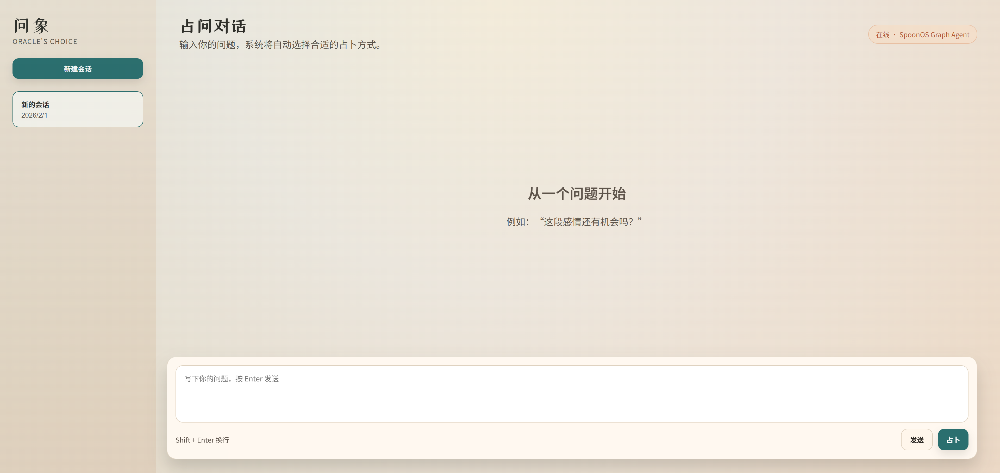
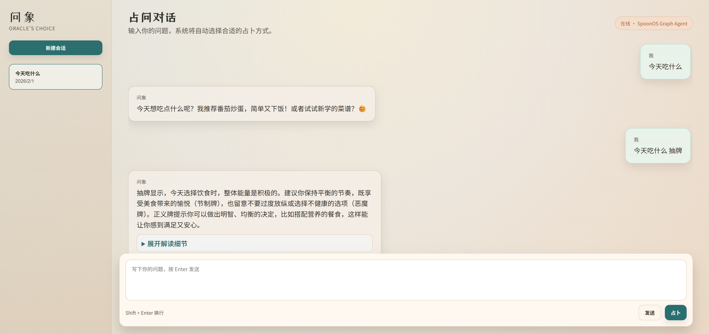
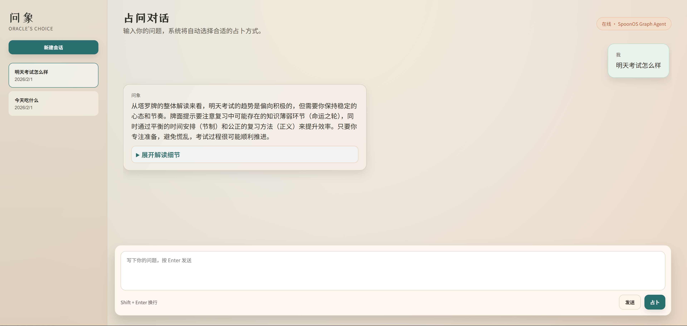
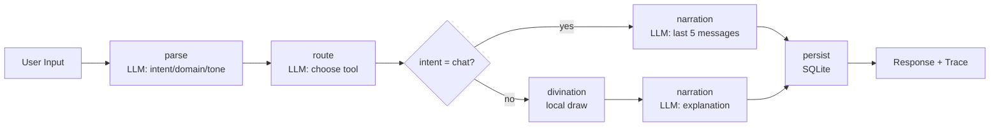

# Oracle's Choice

A SpoonOS Graph Agent–powered oracle app that can **chat empathetically** or **run divination** on demand. It supports multi‑LLM fallback (Gemini → OpenAI), stores session history, and exposes the full workflow trace (Input → Processing → Output).

---

## Screenshots








## ✨ Features

- **Dual mode**: normal chat (contextual) or forced divination.
- **Graph Agent workflow**: `parse → route → divination → narration → persist`.
- **LLM routing** for intent/domain/tone/tool selection.
- **Local divination** (tarot/lenormand/liuyao) for deterministic card draws.
- **Context memory**: last 5 messages per session are injected into chat replies.
- **Trace transparency**: full decision trace returned to UI (deduped to 5 nodes).
- **Multi‑provider fallback**: Gemini first, OpenAI fallback.

---

## 🧱 Architecture Overview

### Backend workflow (SpoonOS Graph Agent)
```
parse (LLM) → route (LLM) → divination (local) → narration (LLM) → persist (db)
```

- **parse**: classifies intent (`chat` / `divination`), domain, tone, clarification need.
- **route**: picks tool (`tarot` / `lenormand` / `liuyao`) for divination.
- **divination**: local draw with deterministic seed.
- **narration**: generates final response (chat or divination explanation).
- **persist**: writes message + reading + trace to SQLite.

### Frontend workflow
- User enters prompt
- Optional **Divination** button
- Sends `force_divination` flag to backend
- Renders response + optional trace + structured result

---

## 📦 Project Structure

```
Oracle-s-Choice/
├── backend/
│   ├── app/
│   │   ├── agent/
│   │   │   ├── graph_agent.py     # SpoonOS Graph Agent
│   │   │   ├── llm_client.py       # LLM wrapper with fallback
│   │   │   └── nodes.py            # rules, keywords, intent detection
│   │   ├── divination/             # tarot / lenormand / liuyao
│   │   ├── storage/                # sqlite persistence
│   │   └── main.py                 # FastAPI entry
│   ├── .env.example
│   └── requirements.txt
├── frontend/
│   ├── src/App.jsx
│   ├── src/styles.css
│   ├── .env.example
│   └── package.json
└── README.md
```

---

## ✅ Requirements

- **Python 3.12+** (required by SpoonOS)
- Node.js 18+ (frontend)

---

## 🔧 Setup (SpoonOS SDK)

SpoonOS is not on PyPI; install from source.

```powershell
cd D:\VSCode\VSCodeProject

git clone https://github.com/XSpoonAi/spoon-core.git
cd spoon-core

py -3.12 -m venv spoon-env
.\spoon-env\Scripts\Activate.ps1
pip install -r requirements.txt
pip install -e .
```

---

## 🔧 Backend Setup

```powershell
cd D:\VSCode\VSCodeProject\CasualHackathon\Oracle-s-Choice\backend

py -3.12 -m venv .venv
.\.venv\Scripts\Activate.ps1

pip install -r requirements.txt
pip install -e D:\VSCode\VSCodeProject\spoon-core
```

### Environment Variables

Copy example:
```powershell
copy .env.example .env
```

Fill in:
```
GEMINI_API_KEY=your-gemini-key
GEMINI_MODEL=gemini-2.5-flash
OPENAI_API_KEY=your-openai-key
```

---

## 🔧 Frontend Setup

```powershell
cd D:\VSCode\VSCodeProject\CasualHackathon\Oracle-s-Choice\frontend

npm install
```

`.env` (frontend):
```
VITE_API_URL=http://127.0.0.1:8001
```

---

## ▶️ Run

### Backend
```powershell
cd backend
.\.venv\Scripts\Activate.ps1
python -m uvicorn app.main:app --reload --host 127.0.0.1 --port 8001
```

### Frontend
```powershell
cd frontend
npm run dev
```

---

## 🧠 Chat vs Divination Modes

### Automatic Mode (default)
- User just types normally.
- LLM decides if this is a chat or divination request.

### Force Divination
- Click **Divination** in UI.
- Forces divination flow regardless of intent.

### Context Handling
- Chat mode includes the **last 5 messages** of the session.

---

## 🔍 API

### POST `/chat`

Request:
```json
{
  "session_id": "uuid-optional",
  "message": "user question",
  "force_divination": false
}
```

Response:
```json
{
  "session_id": "uuid",
  "message": "final response",
  "tool": "tarot|lenormand|liuyao|chat",
  "trace": [
    { "node": "parse", "input": {...}, "output": {...} },
    { "node": "route", "input": {...}, "output": {...} },
    { "node": "divination", "input": {...}, "output": {...} },
    { "node": "narration", "input": {...}, "output": {...} },
    { "node": "persist", "input": {...}, "output": {...} }
  ],
  "reading": {
    "symbols": [...],
    "verdict": "...",
    "advice": ["...", "...", "..."]
  }
}
```

---

## 🧾 Database

SQLite DB file: `backend/oracle_choice.db`

Tables:
- `sessions`
- `messages`
- `readings`
- `agent_traces`

---

## 🔄 SpoonOS Requirements Coverage

✅ **Must use SpoonOS**: Graph Agent uses `spoon_ai.graph.StateGraph`
✅ **Agent system**: Graph Agent with explicit workflow
✅ **Core feature integration**: LLM routing + response generation is central
✅ **Input → Processing → Output**: explicit trace per node

---

## 🧪 Troubleshooting

### `ModuleNotFoundError: spoon_ai`
- SpoonOS not installed into the backend venv
- Re‑run:
  ```powershell
  pip install -e D:\VSCode\VSCodeProject\spoon-core
  ```

### `Rate limit exceeded`
- Gemini RPM too low
- Add OpenAI fallback or change model to `gemini-2.5-flash-lite`

### Frontend not hitting backend
- Ensure `frontend/.env` has correct `VITE_API_URL`
- Restart `npm run dev`

---

## 📌 Notes

- Divination draws are **local and deterministic**.
- LLM is used for **intent + routing + narration**.
- Trace is always returned and displayed in UI for transparency.

---

## 🧠 License

MIT or project default (update if needed).
# 详细项目解说

本项目希望把“占卜”从一次性的仪式感体验，升级为**可解释、可追踪、可切换模式**的智能对话产品。用户并非每次都想抽牌，有时只是需要情绪陪伴与倾听，因此我们在同一套工作流里同时支持**聊天模式**与**占卜模式**。

---

## 1) 为什么要做“双模式”

传统占卜应用的问题：
- 用户输入任何内容都会被强行抽牌，体验割裂。
- 无法记住上下文，用户表达情绪会被“仪式化”打断。

本项目引入：
- **聊天模式**：不抽牌，仅基于上下文对话。
- **占卜模式**：强制进入抽牌流程。
- **自动判断**：不开按钮时由 LLM 判定意图。

---

## 2) 工作流逻辑详解

### 2.1 解析节点（parse）
- 输入：用户问题
- LLM 输出：`intent`（chat/divination）、`domain`（love/career/general）、`tone`（gentle/direct）
- 本地规则作为 fallback，确保低配额时仍可运行。

### 2.2 路由节点（route）
- 当 intent=chat：直接标记 `tool=chat`，不进入抽牌
- 当 intent=divination：LLM 从塔罗/雷诺曼/六爻中选择最合适工具

### 2.3 占卜节点（divination）
- 只在占卜模式触发
- 使用本地随机种子 + 问题 + session_id
- 输出 symbols / verdict / advice

### 2.4 解读节点（narration）
- **聊天模式**：拼接最近 5 条上下文，生成自然对话
- **占卜模式**：要求 LLM 将 verdict/advice 明确映射回用户问题

### 2.5 持久化节点（persist）
- 保存 messages / readings / trace
- trace 经过标准化输出，保证始终 5 节点可视化

---

## 3) 用户体验设计

### 3.1 占卜按钮
- **Send**: auto decide
- **Divination**: force divination

### 3.2 透明决策过程
每次对话都会返回 Agent trace，可展开查看：
```
parse → route → divination → narration → persist
```
增强可信度与可解释性。

---

## 4) 真实使用场景示例

### 场景 A：情绪倾诉（聊天模式）
输入：
> “我最近很累，但不知道怎么说出口。”

系统：
- intent=chat
- 生成温柔回应
- 保留上下文便于持续对话

### 场景 B：明确占卜（按钮开启）
输入：
> “这段感情还有机会吗？”

系统：
- 强制 intent=divination
- route 选择雷诺曼
- 抽牌 → 解读 → 给出结论

---

## 5) SpoonOS 价值体现

- **Graph Agent**：所有节点由 StateGraph 串联
- **LLM Provider 统一管理**：Gemini 主用，OpenAI fallback
- **可解释性**：trace 完整返回
- **拓展性**：未来可新增“自定义占卜流派”或“工具节点”

---

## 6) 未来可扩展方向

- 引入多轮意图确认机制（例如“你是想聊天还是占卜？”）
- 增加“占卜卡牌图库”展示
- 提供“情绪日志”功能，让聊天内容可归档
- Web3 模块：链上记录占卜与情绪趋势

---

如果你需要，我可以继续补充：
- 竞赛答辩用 PPT 文案
- Demo 话术
- 技术架构图（Mermaid / PNG）

---

## Flowchart


